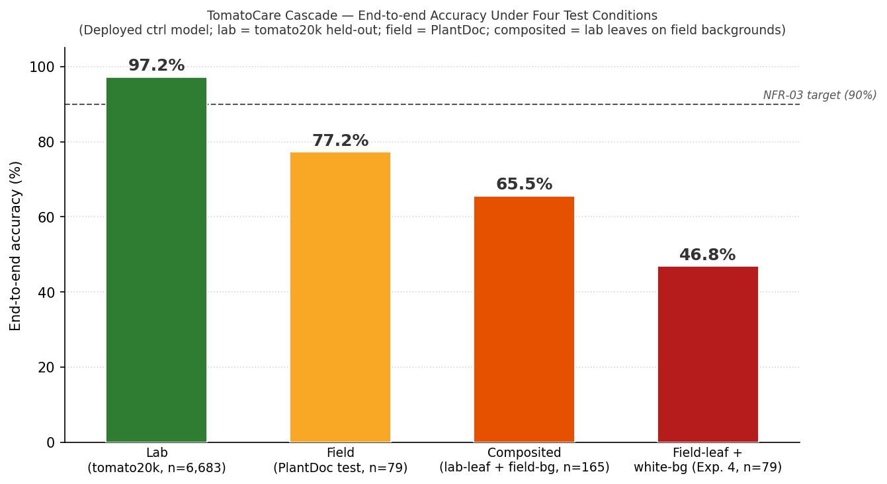
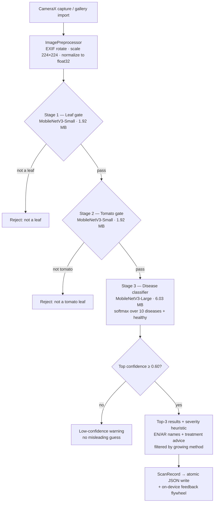

# TomatoCare 🍅

**Point a phone at a tomato leaf, get a diagnosis in ~15 ms — no internet, no server, in English or Arabic.**

TomatoCare is a fully offline, bilingual Android app that diagnoses tomato leaf
diseases on-device with a 3-stage MobileNetV3 TFLite cascade
(leaf gate → tomato gate → 11-class disease classifier), built as a B.Sc.
capstone and engineered to production standards.


<!-- TODO: add app demo GIF (scan → cascade → result screen) -->

<p align="center">
  
</p>

---

## Key Results

| Metric | Value | Target |
|---|---|---|
| Disease accuracy (held-out lab test, n=6,683) | **97.59%** | ≥ 90% |
| End-to-end cascade accuracy (lab) | **97.19%** | — |
| Field accuracy (PlantDoc, n=79) | **77.2%** | — |
| On-device inference (mid-range Android) | **12–20 ms** | — |
| Model size (3-stage cascade, float16 TFLite) | **9.87 MB** (1.92 + 1.92 + 6.03) | ≤ 15 MB |
| Release APK size | **38.51 MB** | ≤ 50 MB |
| Confidence threshold | **0.60** | — |
| Min / target Android API | **26 / 34** | — |
| Network permission | **None** | None |
| JVM unit tests | **48** (+ Compose UI tests) | — |

<details>
<summary><b>Deployed-model confusion matrix (11 classes)</b></summary>
<p align="center">
  
</p>
</details>

---

## Architecture

Every scan runs a gated cascade entirely on-device — non-leaf and non-tomato
inputs are rejected *before* any diagnosis, and low-confidence results warn
instead of guessing:



**Training side (Track A):** dataset prep → per-stage MobileNetV3 training →
calibration → float16 TFLite export (`ml/scripts/export_tflite.py`; float16
chosen over int8 post-training quantisation because int8 cost 2–4% accuracy vs
<0.5% for float16). The three exported models are bundled in the APK as
uncompressed, memory-mapped assets. Full details in
[docs/architecture.md](docs/architecture.md).

---

## Quick Start

**ML track** (Python 3.12, TF 2.15.1):

```bash
pip install -r ml/requirements.txt
python -m ml.scripts.eval_model
```

**Android track** (JDK 17 or 21, Android Studio Iguana+):

```bash
cd android
./gradlew :app:assembleDebug   # build
./gradlew :app:test            # run the 48 JVM unit tests
```

### Getting the models

The three `.tflite` cascade models are **not committed** to git. Either:

1. **Download a release (fastest).** Grab `stage1_leaf_float16.tflite`,
   `stage2_tomato_float16.tflite`, and `stage3_disease_float16.tflite` from
   [Releases](https://github.com/AlBaraa63/TomatoCare/releases) and drop them
   into `android/app/src/main/assets/`.
2. **Produce them from the pipeline.** Run the ML pipeline scripts in
   `ml/scripts/`, which write them to `ml/models/tflite/`; then copy them into
   the assets folder.

The app compiles and runs without them, but every scan will fail until they
are in place.

---

## Tech Stack

| Layer | Technologies |
|---|---|
| ML pipeline | Python 3.12 · TensorFlow 2.15 / Keras · MobileNetV3 (Small ×2, Large ×1) · float16 TFLite export |
| Android app | Kotlin · Jetpack Compose · CameraX · TFLite runtime · hand-rolled DI |
| Storage | Atomic JSON writes (temp-file-then-rename) · Storage Access Framework export/import |
| i18n | Full English + Arabic (RTL) string resources, localised content descriptions |

---

## What It Does

- **Captures** a photo via CameraX or imports from gallery
- **Gates** the image through a leaf check and a tomato check, rejecting
  non-leaf and non-tomato inputs before any diagnosis
- **Classifies** it into 1 of 11 conditions (10 diseases + healthy)
- **Displays** English and Arabic names, confidence score,
  Low/Medium/High/Critical severity badge, and treatment advice
- **Filters** treatments by growing method: Greenhouse, Open Field, Hydroponic,
  or Saline Soil (UAE-specific growing contexts)
- **Warns** when confidence < 60% instead of showing a low-quality guess
- **Stores** every scan locally with atomic JSON writes
- **Exports/imports** scan history via Android's Storage Access Framework

The app never declares the `INTERNET` permission — privacy and offline
operation are hard guarantees, not configuration options.

---

## Repository Structure

```
TomatoCare/
├── ml/                       # Track A — Python ML pipeline
│   ├── configs/training_config.yaml   # single source of truth for hyperparameters
│   ├── dataset/              # raw / augmented images + train/val/test splits
│   ├── models/               # checkpoints + exported TFLite cascade
│   ├── reports/              # evaluation figures (accuracy, confusion matrix)
│   └── scripts/              # sequential pipeline scripts (prep → train → calibrate → export)
├── android/                  # Track B — Android app (Kotlin / Jetpack Compose)
│   └── app/src/main/
│       ├── assets/           # 3× .tflite cascade + treatments.json
│       ├── kotlin/com/tomatocare/
│       │   ├── data/         # models, storage, repository
│       │   ├── inference/    # TFLiteEngine, ImagePreprocessor, SeverityHeuristic
│       │   └── ui/           # Compose screens, ViewModels, navigation
│       └── res/              # values/ (EN) + values-ar/ (AR, RTL)
└── docs/                     # architecture, ML pipeline, app, testing docs
```

---

## Documentation

| Document | Audience | What it covers |
|---|---|---|
| [docs/architecture.md](docs/architecture.md) | Everyone | System design, data flow, component diagram, key decisions |
| [docs/ml-pipeline.md](docs/ml-pipeline.md) | ML / QA | Pipeline stages, config reference, training, evaluation, export |
| [docs/android-app.md](docs/android-app.md) | Android / QA | Screens, ViewModels, inference engine, storage, bilingual system |
| [docs/functional_tests.md](docs/functional_tests.md) | QA | FR-01..FR-28 test matrix with steps and expected results |
| [docs/nfr_verification.md](docs/nfr_verification.md) | QA / Architect | NFR sign-off procedure and current status |

---

## Engineering Practices

TomatoCare is engineered to production standards, not just to demo:

- **Unit-tested core logic** — 48 JVM unit tests (plus Compose UI tests) cover
  the ML↔app class-name contract, JSON serialization **and backward
  compatibility**, the severity heuristic, the Home dashboard statistics, and
  the feedback-flywheel label resolution.
- **Offline by construction** — the `INTERNET` permission is absent from the
  manifest; there is no network code to audit. All inference runs on-device.
- **Crash-safe storage** — scan history and settings use atomic
  temp-file-then-rename writes, so an interrupted write never corrupts data.
- **Robust input handling** — camera (`file://`) and gallery (`content://`)
  images both decode safely off the main thread; a failed decode shows a
  message instead of crashing, and result loading/empty/error states are
  handled explicitly.
- **Reactive settings** — theme switches apply live and a language change
  re-applies the locale, both driven by a single reactive settings flow.
- **On-device feedback flywheel** — users verify each diagnosis; verified images
  export (grouped by true label + manifest) as a retraining set to close the
  lab→field gap — entirely offline, user-owned data.
- **Bilingual + RTL + accessibility** — every user-facing string ships in
  English and Arabic; icons carry localised content descriptions.

---

## Team

| Name | Student ID | Role |
|---|---|---|
| AlBaraa AlOlabi | 202210405 | CV Engineer — dataset prep, 3-stage MobileNetV3 cascade training, calibration, evaluation, TFLite export |
| Ahmed Saeed Ahmed Mohamed | 202211615 | Android Developer (UI/UX) — Compose screens, RTL layout, bilingual toggle |
| Kazi Mahir Al Wafi | 202211829 | Android Developer (Backend) — CameraX, preprocessing, TFLite engine, JSON storage |
| Iyad El Boussi | 202111261 | System Architect & Docs — requirements, UML, design, report |
| Fares Muaatasem Awda | 202211410 | QA & Integration — functional testing, device compatibility |

---

## License

[MIT](LICENSE)
