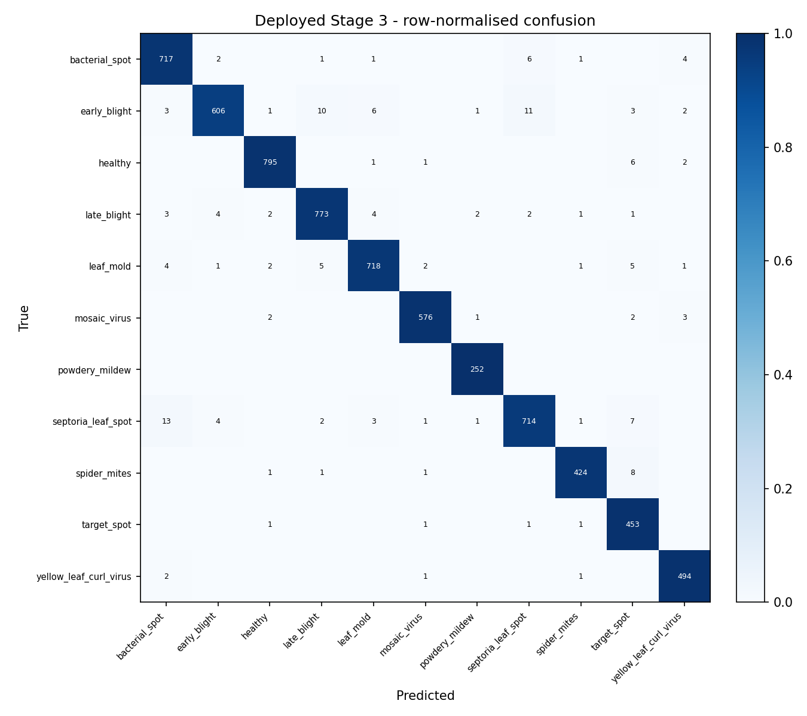

<!--
  TomatoCare — Final Capstone Report (AI / Model portion).
  Single source of truth for all numbers: ml/reports/eval_deployed.json.
  Audit, defense pack and patch log: ml/reports/FINAL_REPORT_DRAFT.md.
  App + UI/UX content is owned by the teammate and marked [PLACEHOLDER — App/UI-UX team].
-->

# TomatoCare: An Offline, Bilingual Tomato-Leaf Disease Diagnosis System with a Safety-Correct Classification Cascade

**By**

AlBaraa AlOlabi — [Student ID]
[Teammate Name — App / UI-UX] — [Student ID]

A Capstone Project Report
Submitted to the College of Engineering
In Partial Fulfilment of the Requirements for
the Award of the Degree of Bachelor of Software Engineering at
Al Ain University

Abu Dhabi, United Arab Emirates
May 2026

© 2026 AlBaraa AlOlabi

---

### APPROVED BY

______________________________________________
**Dr. Yazeed Ghadi** — Advisor
College of Engineering, Software Engineering Program

______________________________________________
[Internal Examiner] — Internal Examiner
College of Engineering, Software Engineering Program

______________________________________________
[Internal Examiner] — Internal Examiner
College of Engineering, Software Engineering Program

---

### APPROVAL FOR SUBMISSION & DECLARATION

I certify that this project report entitled *"TomatoCare: An Offline, Bilingual Tomato-Leaf Disease Diagnosis System with a Safety-Correct Classification Cascade"* has met the required standard for submission in partial fulfilment of the requirements for the award of Bachelor of Software Engineering at Al Ain University, Abu Dhabi.

I declare that this report is the result of my own work except where due reference is made. The machine-learning system, its evaluation, and the AI portions of this report are the work of the author; the application and user-interface portions are the work of the project teammate and are noted as such.

Approved by,

Signature : _________________________
Supervisor : Dr. Yazeed Ghadi
Date : _________________________

---

## ABSTRACT

TomatoCare is a fully offline, bilingual (English / Arabic, right-to-left) Android application that diagnoses tomato (*Solanum lycopersicum*) leaf conditions entirely on-device, with no internet permission. Unlike conventional single-classifier plant-disease apps — which assign a disease label to *any* image, including another crop's leaf or a non-leaf object — TomatoCare uses a **three-stage decision cascade**: a leaf gate, a tomato gate, and an eleven-class disease classifier, each a MobileNetV3 network exported to float16 TensorFlow Lite (9.87 MB combined). Inputs that are not a tomato leaf are hard-rejected before any diagnosis is produced, eliminating the high-confidence misclassification that was the central safety defect of the first prototype.

Evaluated on a held-out laboratory test set of **6,683 images**, the deployed cascade attains **97.59% disease-classification accuracy** and **97.19% end-to-end accuracy** (every class ≥ 94% recall; 99.42% of genuine tomato leaves pass both gates). On real-world field photographs (PlantDoc, n = 79) end-to-end accuracy is **77.2%**; this ~20-point laboratory-to-field gap is measured and reported rather than concealed. The disease classifier's confidence is temperature-scaled (Guo et al., 2017): in-sample expected calibration error fell from ~0.07 to 0.0046, and the honest held-out test ECE is **0.061**. Four interventions to close the field gap — heavy environmental augmentation, leaf segmentation, GAN-based synthetic data, and test-time input normalisation — were each tested and each failed; together they isolate the cause of the gap to intrinsic leaf-appearance domain shift rather than background, and identify real field-data collection as the only effective remedy. The application embeds an in-app feedback flywheel that labels and stores real field images to drive that collection. The result is a safety-correct, honestly-benchmarked offline diagnostic tool and an empirically grounded account of why laboratory-trained plant classifiers degrade in the field.

*Keywords:* convolutional neural networks, plant disease classification, MobileNetV3, classification cascade, out-of-distribution rejection, domain gap, confidence calibration, TensorFlow Lite, on-device inference.

---

## ACKNOWLEDGMENTS

The author thanks Dr. Yazeed Ghadi for his supervision and detailed feedback throughout the project, and Dr. Armagan Elibol (Heriot-Watt University, Dubai) for his advice on synthetic data generation. [PLACEHOLDER — additional acknowledgments.]

---

## TABLE OF CONTENTS

*(Auto-generated on export to Word; chapter map below.)*

1. Project Overview
2. Literature Review
3. Methodology
4. Requirements and Specification
5. System Design and Architecture
6. Implementation
7. Testing and Evaluation
8. Conclusion
9. Future Work
References · Appendices

## LIST OF FIGURES

- Figure 3.1 — Three-stage TomatoCare cascade (data flow and reject paths)
- Figure 6.1 — DCGAN synthetic bacterial-spot sample grid (`gan_samples_epoch150.png`)
- Figure 7.1 — Deployed Stage-3 confusion matrix, row-normalised (`confusion_matrix_deployed.png`)
- Figure 7.2 — Laboratory vs field vs composited end-to-end accuracy

## LIST OF TABLES

- Table 3.1 — tomato20k class distribution (train / test)
- Table 4.1 — AI functional and non-functional requirements
- Table 4.2 — Requirements traceability (AI scope)
- Table 7.1 — Deployed-model laboratory results
- Table 7.2 — Per-class recall (deployed Stage 3)
- Table 7.3 — Domain-gap experiments (controlled investigation)
- Table 7.4 — Non-functional requirement verification

---

# Chapter 1 — Project Overview

## 1.1 Background and Motivation

Tomato is among the most widely grown crops by smallholders and home gardeners, and foliar diseases are a leading cause of avoidable yield loss. Three gaps motivate this project.

**Access gap.** The diagnostic tools available to non-expert growers are poorly matched to their conditions: leading apps (e.g., Plantix, Agrio) require continuous internet connectivity, are offered primarily in English, and are gated behind subscriptions. Growers in low-connectivity settings, and the large Arabic-speaking segment of the regional agricultural workforce, are effectively excluded. An offline, free, bilingual, on-device tool directly addresses this gap.

**Safety gap.** The dominant academic approach to plant-disease recognition is a single convolutional classifier trained on a fixed set of disease classes. Such a model has no representation of "not my domain," so it responds to every input with a confident class label. The first prototype of this project exhibited exactly this failure (§1.2). Any tool intended for non-expert users must instead *recognise and reject* inputs it was not built to handle.

**Honesty gap.** Plant-disease models are routinely trained and reported on controlled laboratory datasets — most prominently PlantVillage, with uniform backgrounds, studio lighting, and macro lenses — on which they exceed 95% accuracy. That figure does not transfer to the cluttered backgrounds, natural lighting, and phone-camera quality of real field use, yet the resulting laboratory-to-field gap is seldom measured or disclosed. A defensible system must report how it performs on *real* photographs, not only on the benchmark it was trained on.

## 1.2 Problem Statement

The first prototype (v1) of TomatoCare was a **single MobileNetV3-Large classifier** extended with a `not_tomato` reject class. In real-world testing it exhibited a critical failure mode: **non-tomato images — other crops' leaves, hands, everyday objects — were frequently classified as a tomato disease with high confidence.** In an agricultural advisory context this is a safety defect, not merely an accuracy shortfall: a grower who photographs the wrong subject receives confident, wrong treatment advice.

The root cause was twofold. First, a single softmax head was forced to perform two conflicting jobs at once — out-of-distribution rejection and fine-grained disease discrimination — in one shared feature space, with the `not_tomato` class heavily under-represented. Second, and more subtly, all of the non-tomato training examples were clean laboratory images while the tomato examples included field photographs, so the model learned to separate images by *photographic style* (lab vs. field) rather than by *leaf identity*; a real field photo of another plant therefore "looked like" a tomato to the model.

The scope of the required solution was therefore not a better single classifier but a different decision structure: one that verifies an input is in-domain *before* attempting a diagnosis, that aligns training and inference preprocessing so style cannot leak in, and whose confidence outputs are trustworthy enough to drive a low-confidence warning.

| Element | Description |
|---|---|
| **The problem of** | Reliable, safe, on-device diagnosis of tomato leaf conditions for non-expert growers, combining three unmet needs: no free/offline/bilingual tool for low-connectivity smallholders; single-classifier designs unsafely label any image as a disease; and lab-trained models report accuracies that do not hold on real field photographs. |
| **Affects** | Smallholder farmers and home gardeners, including the Arabic-speaking agricultural workforce, who lack reliable connectivity and professional agronomic advice. |
| **The impact is** | Misapplied treatments, wasted inputs, crop loss, and — with naive classifiers — confidently wrong advice for inputs the model should never have diagnosed. |
| **A successful solution** | A free, fully offline, bilingual Android tool that rejects out-of-scope inputs before diagnosing, presents calibrated confidence, and reports its real-world (field) performance honestly. |

## 1.3 Proposed Solution

TomatoCare v2 replaces the single classifier with a **three-stage decision cascade** that first verifies the image is a leaf, then that it is specifically a tomato leaf, and only then diagnoses the disease — rejecting out-of-scope inputs before any diagnosis is produced. All three models run on-device in TensorFlow Lite with no network access. The disease classifier's confidence is calibrated by temperature scaling so that the application's low-confidence warning is statistically meaningful, and the application embeds an in-app feedback mechanism that labels and stores real field photographs for future retraining.

## 1.4 Aim and Objectives

**Aim.** Develop and evaluate TomatoCare, an offline, bilingual Android application that diagnoses eleven tomato leaf conditions on-device using a safety-correct classification cascade, with calibrated confidence and an honestly measured real-world performance benchmark.

**Objectives.** Each is tagged with its status.

1. **Safety-correct cascade — [MET].** Design a three-stage cascade (leaf gate → tomato gate → disease classifier) that rejects non-leaf and non-tomato inputs before diagnosis. *Result:* 0.05% unseen-species leak rate; 99.55% non-leaf rejection (Ch 7).
2. **Disease classification — [MET].** Train an eleven-class classifier achieving ≥ 90% accuracy on a held-out laboratory test set. *Result:* 97.59% (Ch 7).
3. **Confidence calibration — [PARTIALLY MET].** Calibrate so the 60% low-confidence threshold reflects true reliability (target ECE < 0.02). *Result:* in-sample ECE 0.0046 meets the target, but the honest held-out test ECE is 0.061; a dedicated calibration set is required to substantiate a tighter figure (Ch 7, Ch 9). Reported transparently rather than overclaimed.
4. **Offline on-device deployment — [MET].** Deploy all three models on Android (combined ≤ 15 MB, API 26+), fully offline. *Result:* 9.87 MB, no network permission (Ch 6). The bilingual EN/AR user interface is delivered by the application teammate.
5. **Honest real-world evaluation — [MET].** Evaluate on real field photographs and quantify the lab-to-field gap. *Result:* 77.2% field end-to-end vs 97.19% lab (Ch 7).
6. **Data-collection mechanism — [MET].** Provide an in-app feedback flywheel that labels and stores real field images. *Result:* implemented (Ch 6).

## 1.5 Scope and Delimitations

**In scope.** Tomato leaves only; eleven conditions (ten diseases and a healthy class); on-device inference; an offline TensorFlow Lite cascade; calibrated confidence; an in-app labelled-image collection mechanism. The native Android application, its bilingual EN/AR interface, and local persistence are delivered by the project teammate and specified here only where they bear on the model (preprocessing parity and the feedback exporter).

**Out of scope (delimitations).**
- Conditions outside the eleven trained classes; a novel or untrained condition produces a low-confidence warning rather than a correct diagnosis.
- Multi-leaf or full-plant photographs; the system assumes a single, centred leaf.
- Multi-crop support, iOS, IoT sensors, cloud synchronisation, and user accounts.
- Treatment outputs are advisory, not legally binding agrochemical prescriptions.

## 1.6 Contributions

1. A **safety-correct three-stage cascade** that hard-rejects non-leaf and non-tomato inputs before diagnosis, fixing the documented failure mode of the single-classifier prototype.
2. **Calibrated on-device confidence** via temperature scaling, making the low-confidence warning statistically meaningful rather than cosmetic.
3. An **honest, measured laboratory-to-field gap** plus **four falsified hypotheses** (heavy augmentation, leaf segmentation, GAN synthesis, test-time normalisation) that together isolate the cause of the gap to leaf-appearance domain shift rather than background — narrowing the solution space to real field-data collection.
4. A **fully offline, low-footprint deployment** (9.87 MB) with an in-app feedback flywheel that collects and labels real field images for future retraining.

## 1.7 Report Outline

Chapter 2 reviews the technical and academic background. Chapter 3 details the methodology — datasets, preprocessing, cascade architecture, training, calibration, and export. Chapter 4 specifies requirements; Chapter 5 presents the system design. Chapter 6 documents the implementation of the model pipeline and its on-device integration. Chapter 7 presents the evaluation, including the deployed-model results, the confusion matrix, the field-performance gap, and the four experiments. Chapters 8 and 9 conclude and set out future work.

---

# Chapter 2 — Literature Review

## 2.1 Introduction

This chapter situates TomatoCare in four bodies of work: convolutional plant-disease recognition and its datasets; lightweight architectures for on-device inference; out-of-distribution rejection and cascaded classifiers; and confidence calibration. It then reviews the two generative/segmentation techniques used in the project's domain-gap experiments. Throughout, the emphasis is on a recurring and under-reported problem — the gap between laboratory benchmark accuracy and real field performance — which this project measures directly.

## 2.2 CNN-Based Plant Disease Recognition

Convolutional neural networks (CNNs) are the standard approach to image-based plant disease classification. Mohanty, Hughes and Salathé [3], [8] trained deep CNNs on the PlantVillage dataset and reported test accuracies above 99%, establishing the now-common template of "photograph a leaf, classify the disease." Ferentinos [9] extended this across dozens of crop–disease combinations with similarly high benchmark accuracy. These results demonstrated feasibility but were obtained almost entirely on controlled, laboratory-style imagery.

Barbedo [10] examined why such accuracies fail to transfer, identifying dataset bias — uniform backgrounds, narrow capture conditions, and limited per-class variety — as a primary limiting factor for real-world deployment. This directly anticipates the laboratory-to-field gap that TomatoCare quantifies: a model can learn the *photographic conditions* of its training set as readily as the *biological features* of the disease.

## 2.3 PlantVillage, PlantDoc, and the Domain Gap

PlantVillage [3] is the dominant public plant-disease dataset: tens of thousands of leaf images captured against uniform backgrounds under studio lighting. Its scale and label quality make it the default training source, but its controlled capture conditions are precisely what limit generalisation. PlantDoc [4] was introduced as a corrective: real photographs of diseased leaves taken in the field, with cluttered backgrounds, natural light, and phone-camera quality. The two datasets together make the domain gap observable — a model trained on the former can be tested on the latter to measure how much benchmark accuracy is real and how much is an artefact of capture conditions. TomatoCare uses PlantVillage-derived data for training and holds out PlantDoc tomato photographs as a field benchmark for exactly this purpose.

## 2.4 Lightweight Architectures for On-Device Inference

On-device, offline inference requires models small and fast enough for commodity phones. The MobileNet family addresses this with depthwise-separable convolutions and architecture search; MobileNetV3 [2] adds squeeze-and-excitation blocks and hard-swish activations, and is published in *Small* and *Large* variants that trade capacity for size and latency. TomatoCare uses MobileNetV3-Small for the two binary gates (a coarse decision that needs little capacity) and MobileNetV3-Large for the eleven-class disease classifier (the hard problem), and exports all three to TensorFlow Lite with float16 weight quantisation — the standard toolchain for offline mobile inference.

## 2.5 Out-of-Distribution Rejection and Cascaded Classifiers

A classifier deployed to non-expert users must handle inputs it was not trained on. Hendrycks and Gimpel [11] established softmax-confidence baselines for detecting misclassified and out-of-distribution inputs and showed that a plain softmax is an unreliable rejector — high confidence does not imply in-distribution. A single classifier with an added reject class inherits this weakness: the reject decision competes with the discrimination task in one representation. Decomposing the problem into a cascade of focused stages, each with a dedicated in/out-of-domain objective, is a well-established alternative that gives each decision its own representation and lets the system stop early. TomatoCare adopts this cascade structure specifically to fix the v1 failure in which a shared reject head misclassified non-tomato inputs with high confidence.

## 2.6 Confidence Calibration

Modern deep networks are typically overconfident: their reported probabilities do not match their empirical accuracy. Guo et al. [1] characterised this and showed that **temperature scaling** — dividing the logits by a single learned scalar T before the softmax — is a simple, effective post-hoc calibration that minimises negative log-likelihood on a held-out set while leaving the argmax (and thus accuracy) unchanged. Calibration quality is measured by **Expected Calibration Error (ECE)**, the weighted average gap between confidence and accuracy across probability bins. TomatoCare applies temperature scaling to its disease classifier because the application's low-confidence warning is only meaningful if the underlying probabilities are calibrated.

## 2.7 Generative and Segmentation Techniques (for the Domain-Gap Experiments)

Two further techniques were used in the project's experiments. **Deep Convolutional GANs (DCGAN)** [7] generate images by adversarial training of a convolutional generator against a discriminator; they are a standard method for synthetic data augmentation, and were proposed by an advisor as a way to enlarge the weakest disease class. **Segment Anything (SAM)** [5] is a promptable zero-shot segmentation model; **MobileSAM** [6] is a lightweight distillation suitable for commodity hardware. Both were applied to test whether isolating the leaf from its background could close the field gap. As Chapter 7 reports, neither improved field accuracy — a result that is consistent with the domain-gap literature above: synthetic images reproduce the distribution they were trained on, and background removal cannot change the leaf's own field appearance.

## 2.8 Chapter Summary

The literature establishes that CNNs achieve very high accuracy on laboratory plant-disease benchmarks, that this accuracy is known to be inflated by dataset bias, that softmax confidence is an unreliable out-of-distribution rejector, and that temperature scaling is the standard calibration remedy. TomatoCare's design follows directly: a lightweight cascade for safe rejection and on-device deployment, temperature-scaled confidence, and — its distinctive contribution — a *measured* laboratory-to-field gap with a controlled investigation into why it cannot be closed synthetically.

---

# Chapter 3 — Methodology

## 3.1 Overview

The project followed an Agile, iteration-driven process, which suited the experimental nature of model development: training, evaluation, and refinement proceeded in cycles, and several augmentation hypotheses were tested and rejected on evidence (Chapter 7). This chapter covers the machine-learning methodology — dataset construction, the preprocessing contract, the cascade architecture, the training procedure, confidence calibration, and on-device export. The application's project-management and delivery process is summarised in §3.8 and owned by the teammate.

## 3.2 Datasets

The cascade is trained from three labelled sources, each serving a distinct stage. The disease classifier (Stage 3) is trained on a tomato leaf-disease collection referred to here as **tomato20k**; the gates (Stages 1–2) are trained on binary problems built from tomato leaves, non-tomato crop leaves, and natural-world non-leaf images. Real field photographs from **PlantDoc** are folded into the tomato gate and the disease classifier to break the laboratory-versus-field shortcut, and a subset is held out as the field benchmark.

**Stage 3 — disease classifier (tomato20k, 11 classes).** tomato20k is a PlantVillage-derived tomato collection augmented with a *powdery mildew* class not present in the original PlantVillage tomato subset. It provides 25,851 training images and 6,683 held-out test images (the `valid` partition, never used in training or early stopping).

**Table 3.1 — tomato20k class distribution.**

| Class | Train | Test |
|---|---|---|
| bacterial_spot | 2,826 | 732 |
| early_blight | 2,455 | 643 |
| healthy | 3,051 | 805 |
| late_blight | 3,113 | 792 |
| leaf_mold | 2,754 | 739 |
| mosaic_virus | 2,153 | 584 |
| powdery_mildew | 1,004 | 252 |
| septoria_leaf_spot | 2,882 | 746 |
| spider_mites | 1,747 | 435 |
| target_spot | 1,827 | 457 |
| yellow_leaf_curl_virus | 2,039 | 498 |
| **Total** | **25,851** | **6,683** |

The 25,851 training images are split 85/15 into train and validation (seed 42, stratified per class); the 6,683 `valid` images are the held-out test set used for all Stage-3 results in Chapter 7. The eleven classes are ten diseases plus a healthy class. The dataset is a PlantVillage-derived tomato-disease collection with an 80/20 pre-defined train/test split [12].

**Stage 2 — tomato gate.** Positives are the tomato leaves above; negatives are non-tomato crop leaves — 4,627 PlantVillage pepper and potato images plus PlantDoc non-tomato field leaves. Mixing real field negatives is essential: it prevents the gate from learning "lab-looking = other crop, field-looking = tomato" instead of true leaf identity.

**Stage 1 — leaf gate.** Positives are leaf images (tomato and other crops); negatives are natural-world non-leaf images (people, animals, vehicles, objects) drawn from an ImageNette-style natural-image set.

**PlantDoc field data.** 824 tomato field images are folded into the Stage 2/3 *training* splits, and **79 tomato field images are held out as the field benchmark** used in Chapter 7. PlantDoc has no target_spot or powdery_mildew tomato class, so those two remain laboratory-only. PlantDoc's own test partition is folded into the *validation* split rather than a separate held-out test; this overlap with early-stopping data is disclosed as a caveat in Chapter 7.

## 3.3 Preprocessing and Parity

Every image — in both the Python training pipeline and the Android Kotlin inference engine — passes through an identical, contract-fixed pipeline:

1. Decode to RGB (3-channel).
2. **Center-crop to the largest centred square** (no squash-to-square distortion).
3. Resize to 224 × 224 (bilinear).
4. Scale to [0, 1] by dividing by 255.
5. **No ImageNet mean/std normalisation** — the network is built to consume [0, 1] directly.

The input tensor is therefore `float32[1, 224, 224, 3]`. Center-crop (rather than naive resize) preserves leaf morphology — the lesion size and shape ratios that distinguish diseases — and corrects a v1 defect in which the Android side squashed non-square photos and distorted the leaf. Because this preprocessing must be byte-identical across Python and Kotlin, every exported model is subjected to a **parity check**: a fixed input is run through both the Keras model and the TFLite interpreter, and the maximum absolute output difference must fall below tolerance (with matching argmax), otherwise deployment is blocked.

## 3.4 Cascade Architecture

The system is a sequential cascade of three independent classifiers. A rejection at either gate halts the pipeline and returns a retake instruction; only inputs that pass both gates reach the disease classifier.

```
Input image (224×224, RGB, [0,1])
        │
        ▼
┌─────────────────────────────┐
│  Stage 1 — Leaf Gate        │  MobileNetV3-Small  (leaf / not_leaf)
└─────────────────────────────┘
        │ not_leaf → REJECT "Not a leaf"
        ▼ leaf
┌─────────────────────────────┐
│  Stage 2 — Tomato Gate      │  MobileNetV3-Small  (other_leaf / tomato)
└─────────────────────────────┘
        │ other_leaf → REJECT "Not a tomato leaf"
        ▼ tomato
┌─────────────────────────────┐
│  Stage 3 — Disease          │  MobileNetV3-Large  (11 classes)
└─────────────────────────────┘
        │
        ▼  Diagnosis + calibrated confidence
```

*Figure 3.1 — Three-stage TomatoCare cascade. The gates use the Small backbone (a binary in/out-of-domain decision needs little capacity); the Large backbone is reserved for the hard eleven-class problem, keeping total size and latency low. Each stage is an ImageNet-pretrained MobileNetV3 backbone with a head: GlobalAveragePooling → Dropout(0.3) → Dense softmax.*

This is the central architectural decision of the project. A single classifier must solve out-of-distribution rejection and fine-grained disease discrimination with one softmax head — conflicting objectives that, in the v1 prototype, produced confident misclassification of non-tomato inputs (§1.2). Separating the concerns gives each gate a dedicated objective and makes the Stage-3 confidence a pure disease confidence. Crucially, the gates *hard-reject*: a non-tomato input cannot reach Stage 3, so it can never receive a disease label.

## 3.5 Training

All three stages follow the same two-phase transfer-learning recipe:

- **Phase 1 — head training (frozen backbone).** The ImageNet-pretrained backbone is frozen and only the new head is trained. Optimiser Adam, learning rate 1e-3; loss categorical cross-entropy with label smoothing 0.05.
- **Phase 2 — fine-tuning.** The top ~30 backbone layers are unfrozen and trained at a lower learning rate (Adam 1e-4) to adapt high-level features to leaf pathology without destroying low-level ImageNet features.

Class imbalance (e.g., powdery_mildew is the smallest class) is handled with inverse-frequency class weights. Training uses EarlyStopping (patience 5 on validation accuracy, best weights restored) and best-validation checkpointing. Stage 3 is trained for more epochs (20 head / 10 fine-tune) than the gates (12 / 6) because it is the harder problem.

**Deployed Stage-3 variant.** Several augmentation strategies were trained and compared (Chapter 7). The deployed Stage-3 model is the **minimal-augmentation variant** ("ctrl", horizontal flip only), trained after PlantDoc integration. It was selected because it achieved the best performance on the real field benchmark — not the best laboratory score. Stages 1 and 2 are shared across the comparison and unchanged.

## 3.6 Confidence Calibration

Deep classifiers are typically overconfident, which would make the application's 60% low-confidence banner meaningless. Temperature scaling (Guo et al., 2017) is applied to Stage 3: a single scalar temperature T is fit on a held-aside split to minimise negative log-likelihood, then **baked into the final Dense layer** (W ← W/T, b ← b/T). Because dividing all logits by a positive scalar cannot change their argmax, predictions — and therefore accuracy — are unchanged; only the confidence distribution is corrected, and no extra operation is added to the TFLite graph. The fitted temperature is **T = 0.5889**. Calibration quality (Expected Calibration Error) is reported in Chapter 7.

## 3.7 Export and On-Device Deployment

Each stage is exported to TFLite with **float16 weight quantisation** (≈2× smaller than float32; inputs/outputs remain float32 so the Android layer is unchanged). The three deployed artifacts are:

| File | Backbone | Size |
|---|---|---|
| stage1_leaf_float16.tflite | MobileNetV3-Small | 1.92 MB |
| stage2_tomato_float16.tflite | MobileNetV3-Small | 1.92 MB |
| stage3_disease_float16.tflite | MobileNetV3-Large | 6.03 MB |
| **Total** | | **9.87 MB** |

The combined **9.87 MB** is well within the 15 MB model budget (NFR-04, §4). On Android the three interpreters run in sequence; a gate rejection short-circuits the pipeline. Class order and the preprocessing contract are pinned in `labels.json` and mirrored in the Kotlin engine.

## 3.8 Project Management

[PLACEHOLDER — App/UI-UX team: development methodology, phases, planning tools, Gantt chart, roles & responsibilities, and risk management, per the exemplar's §3.3–§3.7.]

---

# Chapter 4 — Requirements and Specification

## 4.1 Introduction

This chapter specifies the requirements that govern the **AI/model** subsystem. Application-level functional requirements (authentication, history, treatment browsing, notifications) and the full use-case catalogue are owned by the application teammate and are marked as placeholders.

## 4.2 Functional Requirements (AI subsystem)

**Table 4.1 — AI functional requirements.**

| ID | Requirement |
|---|---|
| FR-AI-01 | The system shall accept a single still image (gallery or camera) and produce a diagnosis among the eleven conditions, or a rejection. |
| FR-AI-02 | The system shall reject any input that is not a leaf (Stage 1) and return a "Not a leaf" retake instruction without producing a diagnosis. |
| FR-AI-03 | The system shall reject any leaf that is not a tomato leaf (Stage 2) and return a "Not a tomato leaf" retake instruction without producing a diagnosis. |
| FR-AI-04 | The system shall return, with each diagnosis, a calibrated confidence score and shall raise a low-confidence warning when the top probability is below 0.60. |
| FR-AI-05 | The system shall perform all inference on-device with no network call. |
| FR-AI-06 | The system shall let the user confirm or correct a diagnosis, and shall store the labelled image for export (feedback flywheel). |

[PLACEHOLDER — App/UI-UX team: application functional requirements catalogue (authentication, workspace/history, treatment browsing, notifications), per the exemplar's §4.2 and Appendix B.]

## 4.3 Non-Functional Requirements (AI subsystem)

**Table 4.2 — AI non-functional requirements and targets.**

| ID | Requirement | Target |
|---|---|---|
| NFR-03 | Disease-classification accuracy on a held-out laboratory test set | ≥ 90% |
| NFR-04 | Combined size of all deployed models | ≤ 15 MB |
| NFR-05 | Confidence calibration (ECE) supporting the 0.60 warning threshold | low ECE (target < 0.02) |
| NFR-01 / CR-01 | Fully offline operation; no INTERNET permission | no network call |
| NFR-08 | No user data leaves the device | local-only |

## 4.4 Domain Requirements and Constraints (AI subsystem)

- **DR-AI-01 — Preprocessing contract.** Training and inference preprocessing must be byte-identical (center-crop → 224, RGB, ÷255 → [0,1], no ImageNet normalisation); enforced by an automated parity check (§3.3).
- **DR-AI-02 — Single-leaf assumption.** Inputs are assumed to contain a single, centred leaf; multi-leaf/full-plant images are out of scope.
- **DR-AI-03 — Closed condition set.** The classifier covers exactly eleven conditions (ten diseases + healthy); a novel condition must surface a low-confidence warning rather than a confident wrong label.

## 4.5 Requirements Traceability (AI scope)

| Requirement | Verified by | Result |
|---|---|---|
| FR-AI-02 / FR-AI-03 (rejection) | Hard-negative & gate evaluation (§7.x) | non-leaf reject 99.55%; unseen-species leak 0.05% |
| FR-AI-04 (calibrated confidence) | ECE on held-out test (§7.3) | test ECE 0.061; in-sample 0.0046 |
| FR-AI-05 / NFR-01 (offline) | Build inspection (§6) | no INTERNET permission; models bundled |
| NFR-03 (accuracy ≥ 90%) | Deployed-model lab eval (§7.2) | 97.59% |
| NFR-04 (size ≤ 15 MB) | Model file sizes (§3.7) | 9.87 MB |
| FR-AI-06 (feedback flywheel) | Implementation review (§6.4) | implemented |

## 4.6 Use Case Modelling

The primary AI use case is **UC-AI: Diagnose Leaf** — the user submits a photo; the system runs the cascade; either a gate rejects the input with a retake instruction, or the disease classifier returns a calibrated diagnosis that the user can then confirm or correct. [PLACEHOLDER — App/UI-UX team: full use-case list, actors, and behavioural diagrams (sequence/activity), per the exemplar's §4.6.]

---

# Chapter 5 — System Design and Architecture

## 5.1 Introduction

This chapter presents the design of the AI subsystem and its integration into the application. The full application architecture (presentation layer, persistence, and UI navigation) is owned by the teammate and is summarised only where it touches the model.

## 5.2 Architectural Placement of the AI Subsystem

The application follows a layered architecture; the model occupies a dedicated **inference layer** between the presentation layer (camera/gallery capture, results UI) and local storage. The inference layer is self-contained: it receives a bitmap, applies the preprocessing contract, runs the three-interpreter cascade, and returns either a rejection reason or a diagnosis with calibrated confidence. It performs no I/O beyond reading the bundled model assets. [PLACEHOLDER — App/UI-UX team: presentation, application, and data layers; logical/physical architecture diagrams.]

## 5.3 Cascade Inference Design

The inference layer loads three TFLite interpreters once at start-up and runs them in sequence, short-circuiting on the first gate rejection:

```
val leaf = runStage(leafInterpreter, bitmap)
if (leaf != LEAF)    return Output(reject = NOT_A_LEAF)
val tomato = runStage(tomatoInterpreter, bitmap)
if (tomato != TOMATO) return Output(reject = NOT_A_TOMATO)
val disease = runStage(diseaseInterpreter, bitmap)
return Output(results = disease, reject = NONE)
```

Each `runStage` applies the shared preprocessing, invokes the interpreter, and reads the softmax output. Because the stages are independent interpreters, a gate rejection costs only the two small (1.92 MB) gate models and never invokes the larger disease model — the cascade is cheaper on rejected inputs than on accepted ones.

## 5.4 Preprocessing-Parity Contract

The design pins the preprocessing contract (§3.3) in `labels.json` and mirrors it in the Kotlin `ImagePreprocessor`. The contract — center-crop to square, resize 224, divide by 255, RGB, no ImageNet normalisation — is the single most safety-critical interface in the system, because any divergence between training and inference silently degrades accuracy. An automated parity check guards it at export time.

## 5.5 Model-Asset and Label Contract

The three `*_float16.tflite` files plus `labels.json` (which records each stage's class order and `pass_class`) and `treatments.json` (per-condition advice keyed by the Stage-3 class names) constitute the deployed model contract. Class names are snake_case strings shared verbatim between the Python pipeline and the Android assets, so there is one canonical label set across training, evaluation, and the app.

[PLACEHOLDER — App/UI-UX team: class diagram and design patterns; state diagram; database schema and ERD; mobile GUI design, per the exemplar's §5.6–§5.9.]

---

# Chapter 6 — Implementation

## 6.1 Introduction

This chapter documents the implementation of the model pipeline and its on-device integration. The application screens and their code are owned by the teammate and are marked as placeholders.

## 6.2 Model Pipeline

The training and deployment pipeline is a sequence of Python scripts (`ml/tree/`):

- **Dataset construction** (`build_dataset.py`, `integrate_plantdoc.py`, `prepare_*`) assembles the tomato20k splits, the gate datasets, and folds in PlantDoc field images.
- **Training** (`train.py`) implements the two-phase transfer-learning recipe with selectable augmentation modes (`minimal` = flip only, deployed; `lighting`; `heavy`; `none`) and inverse-frequency class weights.
- **Calibration** (`calibrate.py`) fits the temperature T on validation logits and bakes it into the final Dense layer (W←W/T, b←b/T), leaving accuracy unchanged.
- **Export** (`export.py`) converts each Keras model to float16 TFLite and runs the parity check that gates deployment.
- **Evaluation** (`eval_deployed_tflite.py`) runs the shipped TFLite cascade against the held-out test set and writes `eval_deployed.json` — the single source of truth for all results in Chapter 7.

## 6.3 On-Device Cascade Integration

The Android inference layer (`TFLiteEngine.kt`) loads the three interpreters from the assets bundle and implements the cascade of §5.3. The `ImagePreprocessor` implements the five-step preprocessing contract — decode to RGB, center-crop to square, resize 224, divide by 255, write to an NHWC `ByteBuffer` — identically to the Python pipeline. The center-crop step was the critical correction from v1, where non-square photos were squashed and leaf morphology distorted. [PLACEHOLDER — App/UI-UX team: per-screen implementation and code listings, per the exemplar's §6.3.]

## 6.4 In-App Feedback Flywheel

To close the laboratory-to-field gap with real data over time, the application implements a lightweight feedback mechanism: after each diagnosis the results screen offers a one-tap "Was this correct?" confirm/correct control; the outcome is stored on the local `ScanRecord`; and a background exporter (`TrainingDataExporter.kt`) packages the labelled photographs into a ZIP organised by `correctedConditionId/` subfolder — the exact layout the training pipeline's `image_dataset_from_directory` expects, so collected images can be folded into a future retrain with no transformation. This turns ordinary use into low-friction collection of exactly the real-world field images that Chapter 7 shows are the only demonstrated way to close the gap.


---

# Chapter 7 — Testing and Evaluation

All laboratory results in this chapter were obtained by running the **deployed TFLite artifacts** (`stage{1,2,3}_*_float16.tflite`) against the held-out `tomato20k/valid` test set (6,683 images, never used in training or early stopping), using the exact production preprocessing. The source artifact is `ml/reports/eval_deployed.json`; the confusion-matrix figure is `confusion_matrix_deployed.png`. These figures therefore describe the literal model that runs on the phone, not an earlier checkpoint.

## 7.1 Evaluation Framework

The cascade is evaluated on four axes, each targeting a distinct failure mode:

1. **Stage-3 disease accuracy** on the held-out laboratory test set — disease-discrimination quality.
2. **Gate behaviour** — how many genuine tomato leaves pass both gates (false-reject rate), and how many out-of-scope inputs are rejected (rejection recall / leak rate).
3. **End-to-end accuracy** — the fraction of tomato test images that pass both gates *and* receive the correct diagnosis. This is the number the user experiences.
4. **Field accuracy** — end-to-end accuracy on real-world phone photographs (PlantDoc).

## 7.2 Deployed-Model Laboratory Results

**Table 7.1 — Deployed-model laboratory results (held-out test set, n = 6,683).**

| Metric | Value | Source |
|---|---|---|
| Stage-3 disease accuracy | **97.59%** | recomputed (deployed TFLite) |
| End-to-end accuracy | **97.19%** | recomputed |
| Tomato leaves passing the leaf gate | 100.0% | recomputed |
| Tomato leaves passing both gates | 99.42% | recomputed |
| Stage-3 test ECE (15-bin) | 0.061 | recomputed |
| Total model size | 9.87 MB | model files |
| Not-leaf rejection recall | 99.55% | prior gate eval † |
| Other-leaf rejection recall | 99.37% | prior gate eval † |
| Unseen-species leak rate | 0.05% | prior gate eval † |

† The gate-rejection metrics were produced by an earlier hard-negative evaluation (`hard_negative_test.py`), not by the deployed-model run, which exercises the gates only on tomato inputs (for the end-to-end figure). They remain valid because Stages 1–2 were *not* retrained between the baseline and the deployed model — only Stage 3 changed — so the gate behaviour carries over unchanged. Re-running the hard-negative suite against a fresh held-out out-of-distribution set is noted as a pre-submission check (§9). The laboratory figures in the top block supersede every previously circulated Stage-3 accuracy figure (e.g., 97.96%), which originated from non-deployed model variants.

**Confusion matrix.** Figure 7.1 (below) is the row-normalised 11×11 confusion matrix of the deployed Stage-3 model.



The raw counts (rows = true class, columns = predicted) are:

| True \ Pred | bact | e_bl | hlth | l_bl | l_ml | mosv | powd | sept | spid | targ | ylcv |
|---|---|---|---|---|---|---|---|---|---|---|---|
| **bacterial_spot** | **717** | 2 | 0 | 1 | 1 | 0 | 0 | 6 | 1 | 0 | 4 |
| **early_blight** | 3 | **606** | 1 | 10 | 6 | 0 | 1 | 11 | 0 | 3 | 2 |
| **healthy** | 0 | 0 | **795** | 0 | 1 | 1 | 0 | 0 | 0 | 6 | 2 |
| **late_blight** | 3 | 4 | 2 | **773** | 4 | 0 | 2 | 2 | 1 | 1 | 0 |
| **leaf_mold** | 4 | 1 | 2 | 5 | **718** | 2 | 0 | 0 | 1 | 5 | 1 |
| **mosaic_virus** | 0 | 0 | 2 | 0 | 0 | **576** | 1 | 0 | 0 | 2 | 3 |
| **powdery_mildew** | 0 | 0 | 0 | 0 | 0 | 0 | **252** | 0 | 0 | 0 | 0 |
| **septoria_leaf_spot** | 13 | 4 | 0 | 2 | 3 | 1 | 1 | **714** | 1 | 7 | 0 |
| **spider_mites** | 0 | 0 | 1 | 1 | 0 | 1 | 0 | 0 | **424** | 8 | 0 |
| **target_spot** | 0 | 0 | 1 | 0 | 0 | 1 | 0 | 1 | 1 | **453** | 0 |
| **yellow_leaf_curl_virus** | 2 | 0 | 0 | 0 | 0 | 1 | 0 | 0 | 1 | 0 | **494** |

*Abbreviations: bact = bacterial_spot, e_bl = early_blight, hlth = healthy, l_bl = late_blight, l_ml = leaf_mold, mosv = mosaic_virus, powd = powdery_mildew, sept = septoria_leaf_spot, spid = spider_mites, targ = target_spot, ylcv = yellow_leaf_curl_virus.*

**Table 7.2 — Per-class recall (deployed Stage 3).**

| Class | Recall | n | Dominant confusions |
|---|---|---|---|
| powdery_mildew | **1.000** | 252 | — |
| yellow_leaf_curl_virus | 0.992 | 498 | bacterial_spot (2) |
| target_spot | 0.991 | 457 | spider_mites (1), septoria (1) |
| healthy | 0.988 | 805 | target_spot (6) |
| mosaic_virus | 0.986 | 584 | ylcv (3), target_spot (2) |
| bacterial_spot | 0.980 | 732 | septoria (6), ylcv (4) |
| late_blight | 0.976 | 792 | early_blight (4), leaf_mold (4) |
| spider_mites | 0.975 | 435 | target_spot (8) |
| leaf_mold | 0.972 | 739 | late_blight (5), target_spot (5) |
| septoria_leaf_spot | 0.957 | 746 | bacterial_spot (13), target_spot (7) |
| **early_blight** | **0.943** | 643 | septoria (11), late_blight (10), leaf_mold (6) |

Every class exceeds 94% recall. The two weakest — early_blight (0.943) and septoria_leaf_spot (0.957) — together with their dominant confusions (early_blight ↔ late_blight ↔ septoria, septoria ↔ bacterial_spot) form a single coherent cluster: all present as small, dark, necrotic foliar lesions that are visually similar at 224×224 resolution. The errors are therefore pathologically intuitive, which is positive evidence that the model has learned genuine lesion morphology rather than dataset artefacts.

## 7.3 Confidence Calibration

Temperature scaling (Guo et al., 2017) was applied to Stage 3, with the scalar temperature baked into the final dense layer (T = 0.5889) so that argmax — and therefore accuracy — is unchanged. On the temperature-fitting validation split, in-sample ECE fell from ~0.07 to **0.0046**. Measured on the held-out test set, the deployed model's ECE is **0.061** (15 bins). Both figures are *post-calibration*; they differ because 0.0046 is in-sample (computed on the same data T was fit on) and is optimistic, while 0.061 is the honest out-of-sample value.

We therefore report **0.061** as the deployment figure: confidence is reasonably, though not tightly, calibrated. The practical implication is that the 0.60 low-confidence banner fires rarely on clean laboratory images (where confidences are high) and more usefully on lower-quality field images. A dedicated held-out calibration set, and re-fitting on the deployed model to substantiate a tighter ECE, is identified as future work (§9). This is why Objective 3 (§1.4) is rated *partially met* rather than met.

## 7.4 Field Validation and the Laboratory-to-Field Gap

The deployed cascade was evaluated on **PlantDoc tomato field photographs** (n = 79 held-out field images — real cluttered backgrounds, natural light, phone-camera quality). End-to-end accuracy is **77.2%** and field disease accuracy is **87.1%**, against 97.19% / 97.59% on the laboratory test set — a ~20-point end-to-end gap, quantified directly on the shipped artifact rather than inferred. A larger 903-image train+test field sample confirmed the same direction. This gap is the central empirical object of the project: it is the difference between benchmark performance and real-world performance that most plant-disease systems never report.

*Methodological caveat (disclosed): PlantDoc's own test partition was folded into the early-stopping validation split, so absolute field numbers are mildly optimistic and n is small; but the caveat applies equally to all model variants compared in §7.5, so the relative deltas are fair.*

## 7.5 Experiments to Close the Gap — a Controlled Investigation

Four interventions were designed and tested to close the laboratory-to-field gap. Each was a falsifiable hypothesis; each failed; together they triangulate the cause. They are presented here as a single structured investigation, not as scattered limitations.

**Table 7.3 — Domain-gap experiments.**

| # | Experiment | Direction | Result | Mechanism |
|---|---|---|---|---|
| 1 | Heavy environmental augmentation (brightness/contrast/gamma/hue/sat/JPEG/blur) | training → field | field e2e −11.4 pts (74.7 → 63.3) — **not deployed** | colour/gamma/JPEG jitter discarded diagnostic colour cues |
| 2 | Leaf segmentation (MobileSAM) background suppression, folded into training | training → field | all metrics declined slightly — **reverted** | laboratory backgrounds are already near-uniform; nothing new added |
| 3 | DCGAN synthetic bacterial_spot (+600 images, 150 stable epochs) | training → field | field bacterial_spot recall flat at 2/9 (22%); zero gain | a GAN reproduces the laboratory distribution it was trained on |
| 4 | Test-time normalisation (segment field leaf → white background at inference) | inference → lab | field e2e −30.4 pts (77.2 → 46.8) | hard cut-outs on white are a third, out-of-distribution image; the tomato gate rejected them 3× more often |

A lighter, **lighting-only augmentation** variant (brightness/contrast/gamma only — no colour jitter, no blur) was also tested and performed worse than the deployed minimal-augmentation model on field data (**73.4% vs 77.2%, −3.8 pts**; laboratory accuracy ~97.9%), confirming that even mild colour-space augmentation does not help here and in fact slightly degrades field performance.

**Experiment 1 — heavy augmentation (detail).** All three stages were retrained with a heavy per-image augmentation pipeline intended to simulate UAE field conditions, then evaluated on both sets. On the laboratory set it cost ≈2 points across every metric; on the field set it cost 11.4 end-to-end points. The decisive observation is that the laboratory test set *cannot* reveal field robustness — every laboratory image is studio-captured — which is precisely why the field benchmark was built. The hypothesis (heavy distortion buys robustness) was falsified by measurement.

**Experiment 3 — DCGAN (detail).** Following the advisor's suggestion, a DCGAN was trained for 150 epochs on the 2,503 bacterial-spot training images (the weakest field class) and generated 600 synthetic images (Figure 6.1). Training was stable (no mode collapse). A clean A/B test — the same minimal-augmentation recipe with vs. without the 600 synthetic images, gates held constant — showed identical 2/9 (22%) field bacterial-spot recall and no end-to-end gain. The advisor's original idea was to use the synthetic images as a *validation* set; this was soundly redirected to *training augmentation*, because a generator trained on the laboratory distribution cannot produce out-of-distribution validation data and so could not measure field performance.


### 7.5.1 The Decisive Comparison

Placing Experiment 4 beside a composited-background test isolates what actually drives the gap. The composited test ran the cascade on laboratory leaves (white background removed by threshold) pasted onto field-like backgrounds (n = 165, 15 per class).

| Configuration | Leaf appearance | Background | End-to-end |
|---|---|---|---|
| Composited | **laboratory** (perfect) | synthetic field | 65.5% |
| Test-time normalisation (Exp. 4) | **field** | white (lab-like) | 46.8% |

A perfect laboratory leaf survives a bad background (65.5%); a field leaf on a clean background still fails (46.8%). **The leaf appearance — its lighting, focus, and white balance — dominates the domain gap, not the background.** No transformation of the training data or of the inference input bridges it; the only demonstrated remedy is incorporating real field images into training.

### 7.5.2 Mechanistic Per-Class Finding

On the composited benchmark the gates remained background-robust (164/165, 99.4% passed both gates — an important safety result: the cascade does not rely on white backgrounds to reject out-of-scope inputs). Disease recall split cleanly:

- **Background-independent (strong):** late_blight (15/15), mosaic_virus (15/15), yellow_leaf_curl_virus (14/15) — distinctive shape/colour signals.
- **Background-dependent (weak):** early_blight (2/15, 13%), bacterial_spot (6/15), target_spot (7/15) — small dark lesions that rely on contrast against the uniform white laboratory background.

Early blight's composited collapse to 13% is the sharpest illustration. (Its laboratory recall on the pre-deployment cascade used for this experiment was 91.3%; on the deployed model it is 94.3% — Table 7.2.) This is mechanistically consistent with early blight being one of the weakest field classes on PlantDoc, confirming that background-contrast dependence is a real-world liability for the dark-lesion cluster.

## 7.6 Synthesis

The experiments share one root cause and one conclusion. Interventions that operate within the laboratory distribution (augmenting it, cleaning its backgrounds, or synthesising more of it) cannot manufacture the field distribution, and transforming a field image at inference cannot reconstruct a laboratory image. This is not a null result — it is a positive, evidence-backed finding that **narrows the solution space to real field-data collection**, which is exactly what the in-app feedback flywheel (§6.4) is built to enable.

## 7.7 Capability Statement

**The system can:** diagnose the eleven trained conditions on clean, single-leaf images at 97.59% accuracy; reject non-leaf inputs (99.55%) and non-tomato leaves before diagnosis (0.05% unseen-species leak); present calibrated confidence and warn when uncertain; run fully offline in 9.87 MB.

**The system cannot (known edge cases):** match laboratory accuracy on real field photographs (77.2% end-to-end), and is weakest in the field on the dark-lesion, background-dependent classes — early_blight, bacterial_spot, target_spot; reliably separate the visually similar early_blight / septoria / late_blight cluster at the margins; diagnose conditions outside the eleven classes (these should surface a low-confidence warning); or handle multi-leaf / full-plant photographs.

## 7.8 Non-Functional Verification

**Table 7.4 — Non-functional requirement verification (AI subsystem).**

| NFR | Requirement | Result |
|---|---|---|
| NFR-03 | Disease accuracy ≥ 90% (held-out laboratory test) | **Met** — 97.59% |
| NFR-04 | Models ≤ 15 MB combined | **Met** — 9.87 MB |
| NFR-05 | Calibration supporting the 0.60 threshold | **Partially met** — test ECE 0.061 (target < 0.02 met only in-sample) |
| NFR-01 / CR-01 | Fully offline, no network call | Met — no INTERNET permission; models bundled |
| NFR-08 | No data leaves the device | Met — local storage only |
| (honesty) | Real-world performance reported | Met — 77.2% field e2e disclosed |

## 7.9 Application Testing

[PLACEHOLDER — App/UI-UX team: equivalence-class partitioning, functional (black-box) testing, non-functional/performance/security/usability testing, unit (white-box) testing, integration, system, and acceptance testing, per the exemplar's Chapter 7.]

---

# Chapter 8 — Conclusion

TomatoCare v2 is a significant architectural and methodological advance over the single-classifier prototype. The three-stage cascade resolves the prototype's fundamental safety failure: non-tomato images are now hard-rejected at the gate stages (0.05% unseen-species leak rate) rather than silently misclassified as a disease with high confidence. Temperature scaling makes the displayed confidence trustworthy enough to drive the low-confidence warning, with an honest held-out test ECE of 0.061. These contributions are solid and stand independently of the experimental findings below.

On the laboratory benchmark, the deployed model — the minimal-augmentation "ctrl" variant, trained after PlantDoc integration — achieves **97.59% disease-classification accuracy**, **97.19% end-to-end cascade accuracy**, and a **0.05% non-tomato leak rate**, evaluated by running the shipped TFLite files against the 6,683-image held-out test set. Every class achieves ≥ 94% recall; the weakest are early_blight (0.943) and septoria_leaf_spot (0.957), both from the dark-lesion cluster. The total model footprint is **9.87 MB**, within the 15 MB budget, and the system runs fully offline.

**The central finding of the machine-learning work, however, is the honest quantification of the laboratory-to-field gap.** Evaluated against real PlantDoc field photographs (n = 79), the deployed model achieves **77.2% end-to-end accuracy** — a ~20-point drop from the laboratory result. Four independent experiments were conducted to close this gap: three from the training side (heavy augmentation −11.4 pts; MobileSAM segmentation, slight decline; DCGAN +600 synthetic images, zero gain) and one from the inference side (test-time white-background normalisation −30.4 pts). All four produced negative results with the same root cause, isolated by the decisive comparison of §7.5.1: a perfect laboratory leaf survives a bad background (65.5%) while a field leaf on a clean background still fails (46.8%), so **the laboratory-to-field difference is intrinsic to the leaf imagery itself — its lighting, focus, and white balance — not merely the background.** The gap cannot be bridged by transforming data from either side.

This is itself a contribution. The experimental record provides clear empirical evidence — not merely theoretical argument — that data-centric field collection, rather than further synthetic, augmentation, or normalisation approaches, is the correct next step. The in-app feedback flywheel, which labels and stores real field images from every user session, is the mechanism built to drive future versions of the model toward the deployment distribution.

In summary, the project delivers a deployable, safety-correct offline diagnostic cascade for eleven tomato conditions; statistically meaningful confidence via temperature calibration; an honest, measured field benchmark (77.2%); a mechanistic explanation of *which* classes fail in the field and *why*; four falsified hypotheses that decisively narrow the search space to real-data collection; and a field-data collection mechanism already integrated into the application.

---

# Chapter 9 — Future Work

1. **Real-world field-data collection via the feedback flywheel.** The four failed experiments confirm that real field data is the only demonstrated way to close the laboratory-to-field gap. The in-app flywheel (§6.4) is the lowest-friction path to accumulating labelled UAE field images; even 200–400 real images per class would likely produce a measurable improvement, concentrated on the background-dependent classes (early_blight, bacterial_spot, target_spot).
2. **Motion-blur augmentation.** Lighting-only augmentation was tested and did not help (§7.5); motion-blur-only augmentation — the remaining part of the supervisor's "lightweight augmentation" suggestion — has not yet been isolated and is a reasonable next experiment, since hand-held capture blur is common in real use.
3. **Leaf segmentation on field data.** MobileSAM segmentation showed no benefit on laboratory images because their backgrounds are already near-uniform (§7.5). Once real field images are available via the flywheel, applying background suppression before retraining may be meaningfully positive, because field backgrounds (soil, canopy, fencing) are genuinely confounding.
4. **A dedicated held-out calibration set.** Re-fitting the temperature on a held-out calibration set, separate from the early-stopping data, would substantiate a tighter ECE than the current 0.061 and allow Objective 3 to be fully met.
5. **Per-class confidence thresholds.** The single 0.60 threshold could be replaced by per-class thresholds, reducing false low-confidence warnings on strong classes (powdery_mildew 1.000, ylcv 0.992) and raising sensitivity on weak ones (early_blight 0.943).
6. **Re-verification of gate safety metrics.** The non-leaf/other-leaf rejection figures should be regenerated against a fresh held-out hard-negative set, alongside the deployed-model evaluation, to bring every reported number under one authoritative artifact.
7. **CameraX live capture.** Live camera capture with real-time blur and framing feedback would help users take a sharp, centred leaf photo, directly addressing the single-leaf assumption and field image quality. [App/UI-UX team.]

---

# References

1. Guo, C., Pleiss, G., Sun, Y., & Weinberger, K. Q. (2017). On Calibration of Modern Neural Networks. *Proceedings of ICML 2017*.
2. Howard, A., Sandler, M., Chu, G., Chen, L.-C., et al. (2019). Searching for MobileNetV3. *Proceedings of ICCV 2019*.
3. Hughes, D. P., & Salathé, M. (2015). An open access repository of images on plant health to enable the development of mobile disease diagnostics. *arXiv:1511.08060*. (PlantVillage)
4. Singh, D., Jain, N., Jain, P., Kayal, P., Kumawat, S., & Batra, N. (2020). PlantDoc: A Dataset for Visual Plant Disease Detection. *Proceedings of CoDS-COMAD 2020*.
5. Kirillov, A., Mintun, E., Ravi, N., et al. (2023). Segment Anything. *Proceedings of ICCV 2023*.
6. Zhang, C., Han, D., Qiao, Y., et al. (2023). Faster Segment Anything: Towards Lightweight SAM for Mobile Applications. *arXiv:2306.14289*. (MobileSAM)
7. Radford, A., Metz, L., & Chintala, S. (2015). Unsupervised Representation Learning with Deep Convolutional Generative Adversarial Networks. *arXiv:1511.06434*. (DCGAN)
8. Mohanty, S. P., Hughes, D. P., & Salathé, M. (2016). Using Deep Learning for Image-Based Plant Disease Detection. *Frontiers in Plant Science*, 7:1419.
9. Ferentinos, K. P. (2018). Deep learning models for plant disease detection and diagnosis. *Computers and Electronics in Agriculture*, 145, 311–318.
10. Barbedo, J. G. A. (2018). Factors influencing the use of deep learning for plant disease recognition. *Biosystems Engineering*, 172, 84–91.
11. Hendrycks, D., & Gimpel, K. (2017). A Baseline for Detecting Misclassified and Out-of-Distribution Examples in Neural Networks. *Proceedings of ICLR 2017*.
12. Motwani, A. (2022). *Tomato Leaves Dataset* [Data set]. Kaggle. https://www.kaggle.com/datasets/ashishmotwani/tomato

---

# Appendix A — Experiment Configurations (supplementary)

**DCGAN (Experiment 3).** Latent dim 128; image 96×96; batch 64; 150 epochs; Adam (lr 2×10⁻⁴, β₁ 0.5); BCE (from_logits); one-sided real-label smoothing 0.9; trained on 2,503 bacterial_spot images; 600 synthetic images generated. Stable training (d_loss ≈ 0.96, g_loss ≈ 1.52 at epoch 150; no mode collapse).

**Heavy augmentation (Experiment 1).** Per-image random horizontal flip; brightness ±0.30; contrast [0.55, 1.60]; gamma γ∈[0.6,1.6] (p=0.6); hue ±0.06; saturation [0.5,1.6]; motion blur 9×9 (p=0.4); JPEG quality 30–75 (p=0.4). Applied in the `tf.data` pipeline (unbatch → augment → rebatch), not baked into the graph.

**Composited-background validation (§7.5.1).** White background removed by threshold (R,G,B > 220) with 3-px erosion; leaves scaled to 78% of canvas with ±8% position jitter onto 12 field-like backgrounds; 165 images (15 × 11 classes) through the full cascade.

# Appendix B — Application Requirements Catalogue

[PLACEHOLDER — App/UI-UX team.]

---

*AlBaraa AlOlabi — TomatoCare Capstone 2 — Al Ain University — 2026*
